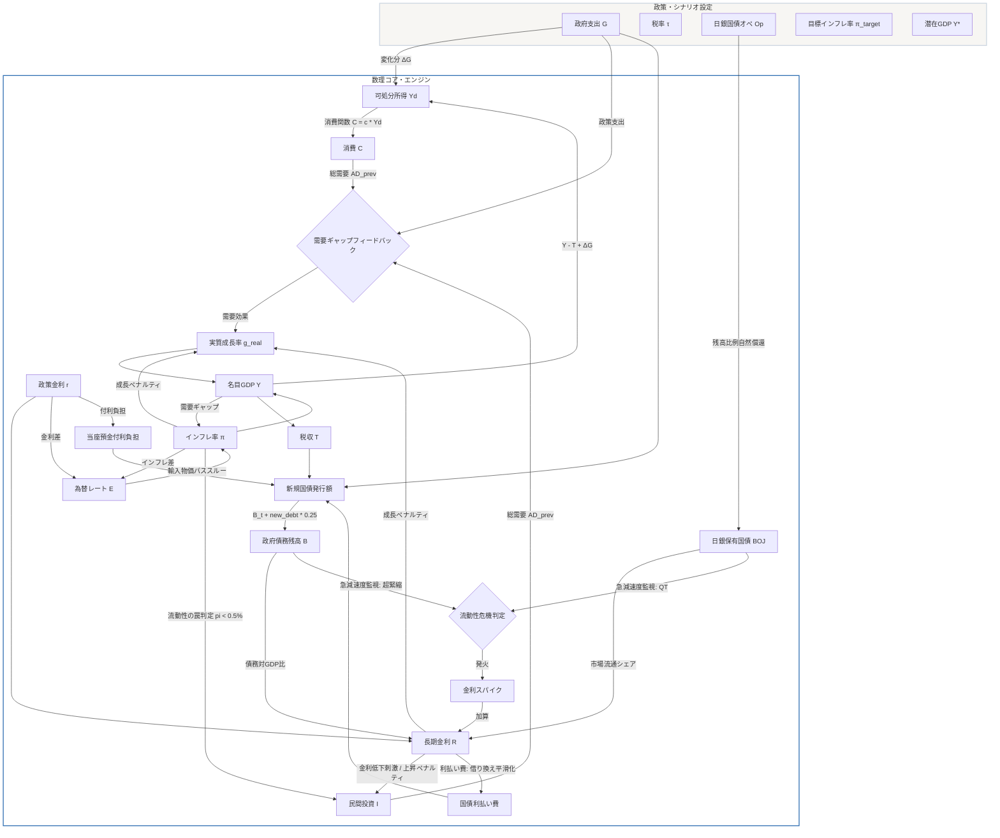

# JAPAN-A_Core マクロ経済シミュレーター 数理設計仕様書

本仕様書は、「JAPAN-A_Core マクロ経済シミュレーター」における数理方程式系、各政策パラメータの伝播経路（トランスミッション・メカニズム）、および主要マクロ経済指標間の連動関係を網羅的に定義した設計ドキュメントです。

---

## 🌌 1. 全体構造とストック・フロー関係 (SFC)

本モデルは、**ストック・フロー一貫性（SFC: Stock-Flow Consistent）** のエッセンスを土台とし、政府・民間（家計・企業）・中央銀行（日本銀行）の3部門における資金循環および貸借対照表（B/S）の会計的整合性を毎期（四半期 `dt=0.25` 単位）厳密に成立させています。



---

## 🧠 2. マクロ経済動学方程式系

シミュレーションの毎期（`t \to t+1`）において実行される差分方程式の厳密な定義です。

### 2.1 長期金利決定方程式（流動性枯渇リスクと不規則金利スパイク）
市場長期金利 `R_t` は、短期の政策金利 `r_t` をベースに、日銀の国債引き受け度合いによる「ターム・プレミアム」と、政府の債務持続性による「リスク・プレミアム」に加えて、市場流動性枯渇に伴う不規則な「金利スパイク（暴走プレミアム）」が加算されて決定されます。

1. **市場流通国債シェア (`market_share_t`)**
   日銀のバランスシートから外れ、民間部門が引き受けている国債の割合です。
   $$market\_share_t = \frac{B_t - BOJ_t}{B_t}$$
   * `B_t`: 普通国債残高ストック (兆円)
   * `BOJ_t`: 日銀保有国債残高ストック (兆円)

2. **ターム・プレミアム (`\tau_t`)**
   市場流通シェアが初期値（約 48.6%）から乖離するほど、民間投資家が要求するプレミアムが変化します（感応度 `\delta = 0.05`）。
   $$\tau_t = 0.0275 + 0.05 \times (market\_share_t - 0.4861)$$

3. **市場流動性枯渇と金利スパイク (`liquidity_spike_t`)**
   量的引き締め（QT）や急激な歳出削減（超緊縮）にともない、日銀保有国債の急減 `boj_decrease_t = BOJ_{t-1} - BOJ_t` が四半期で `32.0` 兆円（月2兆円以下のオペ相当）を超えるか、または政府債務残高の急減 `debt_decrease_t = B_{t-1} - B_t` が `15.0` 兆円を超える場合、市場流動性危機が発火します。発火時、金利市場コントロールの喪失による不規則な暴騰スパイクが加算されます。
   $$liquidity\_spike_t = \begin{cases} 0.04 + 0.02 \times \left| \sin(step \times 1.5) \right| & (\text{if } boj\_decrease_t > 32.0 \text{ or } debt\_decrease_t > 15.0) \\ 0 & (\text{otherwise}) \end{cases}$$
   * `step`: シミュレーションの経過ステップ数（四半期単位）

4. **長期金利 (`R_t`)**
   債務対GDP比率 (`B_t / Y_t`) の悪化にともなう長期金利の上昇圧力を双曲線正接関数 (`\tanh`) で表現し、そこに流動性金利スパイクを重畳して最終長期金利を決定します。
   $$R_t = \max\left(r_t, r_t + \tau_t + 0.08 \times \tanh\left(0.3 \times \left(\frac{B_t}{Y_t} - 1.6548\right)\right) + liquidity\_spike_t\right)$$
   * `1.6548`: 初期（令和8年度）の債務対GDP比率の基準値

### 2.2 為替レート動学方程式（金利平価と購買力平価の調停）
為替レート（円/ドル） `E_t` は、長期的収束力を持つ「購買力平価（物価上昇率差）」と、短期的資産選択に基づく「国際金利平価（日米金利差）」の相互作用により動学的に更新されます。

$$E_{t+1} = E_t \times (1 + \Delta E_t)$$
$$\Delta E_t = \text{clamp}\left(0.2 \times (\pi_t - 0.02) - 0.05 \times (r_t - 0.045), -0.1, 0.1\right)$$
* `E_t`: 為替レート (円/ドル、初期値 150.0)
* `0.02`: 世界（米国等）の基準インフレ率 (2.0%固定)
* `0.045`: 海外（米国等）の政策金利 (4.5%固定)
* `0.2`: インフレ感応度（PPP効果：自国のインフレ高進は通貨の購買力低下＝円安を招く）
* `0.05`: 金利感応度（UIP効果：自国の利上げは投機的資金流入＝円高を招く）
* `clamp(\dots, -0.1, 0.1)`: 急激な投機的暴走によるクラッシュを回避する ±10% 変動幅クランプ

### 2.3 インフレ率決定方程式
インフレ率 `\pi_{t+1}` は、過去のインフレ実績の慣性と目標値への回帰に加えて、「需給ギャップ（GDPギャップ）」、「為替コストプッシュ」、「財政フローショック」の3大要因が加算されて決定されます。

$$\pi_{t+1} = \text{clamp}\left(\pi_{\text{inertia}, t} + 0.01 \times gdpGapRate_t + 0.015 \times \frac{E_t - E_{\text{init}}}{E_{\text{init}}} + 0.0001 \times (G_{\text{policy}} - 91.0), -0.05, 0.15\right)$$
$$\pi_{\text{inertia}, t} = 0.85 \times \pi_t + 0.15 \times \pi_{\text{target}}$$
* `gdpGapRate_t = \frac{Y_{real, t} - Y_{pot}}{Y_{pot}}` (実質需要と潜在供給能力のギャップ)
* `Y_{real, t} = \frac{Y_t}{1 + \pi_t}` (物価調整後の実質需要)
* `E_{init}`: シミュレーション開始時点（t=0）の初期為替レート
* `G_{policy} = G_{input} \times 0.91`: スケーリング適用後の実効支出フロー
* `clamp(\dots, -0.05, 0.15)`: 年率換算で -5.0% から +15.0% の制限バリア

### 2.4 実質・名目GDP決定方程式とSFC乗数因果ループ
本モデルでは、名目GDPの自己増殖的発散を根絶するための**「実質決定構造」**に加え、政府支出 `G` の増減が民間可処分所得 `Y_d` および消費 `C` を経由して実質成長率に強力にフィードバックされる**「ストック・フロー一貫 (SFC) 乗数ループ」**を統合しています。

1. **民間可処分所得 (`Y_{d, t}`)**
   政府支出 `G_{policy, t}` の基準値（91.0兆円）からの変化分 `\Delta G_t = G_{policy, t} - 91.0` は、民間セクターの所得フローとしてダイレクトに結合します。
   $$Y_{d, t} = \max\left(0, Y_t - T_t + (G_{policy, t} - 91.0)\right)$$

2. **消費関数 (`C_t`) と民間投資 (`I_t`) の神経接続**
   消費 `C_t` は民間可処分所得 `Y_{d, t}` の決定論的関数として神経接続されます（初期適合消費性向 `c \approx 0.6256`）。
   $$C_t = 0.6256 \times Y_{d, t}$$
   民間投資 `I_t` は、金利差 `R_t - R_{initial}` （`R_{initial} = 0.03`）に基づく投資刺激（インフレ率が 0.5% 未満のデフレ圏＝流動性の罠発生時は刺激効果が 15% に減退）と、金利上昇時の投資ペナルティの動的二分法で決定されます。
   $$I_t = Y_t \times (0.20 + investmentEffect_t)$$
   $$investmentEffect_t = \begin{cases} -0.5 \times (R_t - 0.03) & (\text{if } R_t \ge 0.03) \\ -0.5 \times (R_t - 0.03) \times 0.15 & (\text{if } R_t < 0.03 \text{ and } \pi_t < 0.005) \\ -0.5 \times (R_t - 0.03) & (\text{otherwise}) \end{cases}$$

3. **総需要ギャップフィードバック (`demand_effect_t`)**
   前期の総需要 `AD_{prev} = C_{prev} + I_{prev} + G_{policy\_prev}` が、初期基準需要合計 609.9 兆円（380.5 + 138.4 + 91.0）からどれだけ乖離しているかを表す需要ギャップ `demand_gap_t = \frac{AD_{prev} - 609.9}{609.9}` を定義します。
   実質成長率への需要フィードバック効果 `demand_effect_t` には、景気過熱による実質成長の発散防止と、デフレ下振れのペナルティを非対称に制限する安全クランプ（-6.0% 〜 +2.5%）を適用します。
   $$demand\_effect_t = \text{clamp}(0.12 \times demand\_gap_t, -0.06, 0.025)$$

4. **実質成長率 (`g_{real, t}`)**
   実質成長率は、潜在的成長率 1% に対し、需要ギャップフィードバックと、インフレおよび金利のペナルティが加減算されて決定されます。
   $$g_{\text{real}, t} = 0.01 + demand\_effect_t - 0.08 \times \max(0, \pi_{t+1} - 0.02) - 0.05 \times \max(0, R_t - 0.03)$$

5. **名目GDPの導出とロバストネスクランプ (`Y_{t+1}`)**
   シミュレーションが極端な政策パラメータ下でも `NaN` や負値にクラッシュしないよう、実質GDP `Y_{real}` に下限 10.0 兆円の堅牢性クランプを設けて名目GDPを決定します。
   $$Y_{\text{real}, t+1} = \max\left(10.0, Y_{\text{real}, t} \times (1 + g_{\text{real}, t})\right)$$
   $$Y_{t+1} = Y_{\text{real}, t+1} \times (1 + \pi_{t+1})$$

### 2.5 財政収支と国債残高ストック方程式
政府支出、税収、国債利払い、および日銀当座預金の金利付利による追加財政負担が、新規国債発行を通じて翌期の国債残高にストックとして加算されます。

1. **実効税収 (`T_{t+1}`)**
   $$T_{t+1} = \tau_{\text{input}} \times Y_{t+1} \times 0.60486$$
   * `0.60486`: 初期税収実態値（83.7兆円）に適合させるための調整実効係数

2. **国債借り換え動学（ヤコビアン平滑化）による利払い費 (`interest_payment_{t+1}`)**
   「金利上昇時に国債利払い費が即座に牙を剥く」という単純モデルの齟齬を正し、日本の普通国債の平均残存期間（約7〜9年）に適合した遷移モデルです。
   $$\text{interest\_payment}_{t+1} = B_{t+1} \times \left( (1 - \lambda) \times R_{\text{init}} + \lambda \times R_t \right)$$
   * `\lambda = 0.03`: 四半期あたりの国債満期借り換え率（年間で約12%が新金利に置き換わる）
   * `R_{init}`: 初期状態（t=0）における国債の平均利率（初期状態ハイドレーション値）

3. **当座預金付利負担 (`boj_interest_payment_{t+1}`)**
   政策金利 `r` が上昇した際、日銀当座預金（民間銀行準備）への付利支払いが増大し、政府の統合的な歳出負担を押し上げます。
   $$\text{boj\_interest\_payment}_{t+1} = J_{\text{pos}} \times r_{t+1}$$
   * `J_{pos}`: 日銀当座預金負債ストック (兆円)

4. **国債残高の動学的更新 (`B_{t+1}`)**
   $$\text{new\_debt\_issued}_{t+1} = (G_{\text{policy}} + \text{interest\_payment}_{t+1} + \text{boj\_interest\_payment}_{t+1}) - T_{t+1}$$
   $$B_{t+1} = B_t + \text{new\_debt\_issued}_{t+1} \times 0.25$$

### 2.6 日銀国債保有残高ストック方程式（償還モデルと民間保有国債非負保証）
日銀保有国債残高 `BOJ_t` は、月間国債買い入れオペ額 `Op` の新規購入フローと、保有する国債ストックが満期を迎えて国債元本が政府へ払い戻される残高比例型の「自然償還」の差分で更新されます。また、日銀の国債保有量が総国債残高を上回ることがないよう、前ステップの総国債残高 `B_{t-1}` で上限処理（クランプ）を行います。

$$BOJ_t = \max\left(0, \min\left(B_{t-1}, BOJ_{t-1} + (Op \times 3) - Redeem\_flow_{t-1}\right)\right)$$
$$Redeem\_flow_{t-1} = BOJ_{t-1} \times 0.06667$$
* `Op`: 月間国債買い入れ額 (兆円/月、四半期で `Op \times 3` 加算)
* `0.06667`: 保有残高依存の償還減衰係数（初期残高 600兆円に対して四半期 40兆円の償還フローが生じる実態ファクトから 40 / 600 で算出）
* **【民間保有国債非負保証 of 意義】**: `BOJ_t \le B_{t-1}` の上限処理と、民間保有国債 `B_{private, t} = B_t - BOJ_t` の定義により、超緊縮時に国債発行残高が急減した際にも民間保有国債がマイナス（不整合値）にならず、会計整合性等式が極端なエッジケースでも常に保証されます。

### 2.7 政策金利決定方程式（テイラー・ルールとヤコビアン制約）
日本銀行は、当期のインフレギャップおよびGDPギャップを検知し、金利操作を行います。

$$r_{\text{target}, t+1} = 0.0025 + 1.5 \times (\pi_{t+1} - \pi_{\text{target}}) + 0.5 \times gdpGapRate_{t+1}$$
$$r_{t+1} = \max\left(0, r_t + \text{clamp}\left(r_{\text{target}, t+1} - r_t, -\Delta r_{\text{max}}, \Delta r_{\text{max}}\right)\right)$$
* `0.0025`: 中立金利基準値（0.25%）
* `\Delta r_{max}`: 1期（四半期）あたりの最大金利変動許容量スライダー

---

## 📈 3. 各政策介入パラメータの伝播経路 (Transmission Paths)

スライダーを操作した際に、他のマクロ指標がどのような数理経路（因果チェーン）をたどって変動するかの詳細整理です。

### 3.1 政府支出 (G) の感応度と伝播経路

```
[ G の拡大 ]
    │
    ├─(直接的フロー効果)─> 政府支出 (G_policy) が増加
    │                       │
    │                       ├─> 歳出総額 (total_spending) が増加 ──> 【政府債務 B】が累積加速
    │                       │
    │                       └─(財政フローショック)─> 【インフレ率 π】に上昇圧力 (+0.0001 per 兆円)
    │                                                    │
    └─(実体需要・ギャップ効果)                          │
        Y_real = Y / (1+π)                               │
        実質GDP需要が直接創出され、[GDPギャップ] が改善 ───┘
                                 │
        ┌────────────────────────┘
        ▼
   【インフレ率 π】が上昇 ──> (テイラー・ルール) ──> 【政策金利 r】が上昇 ──> 【長期金利 R】が上昇
        │                                                                           │
        ├─(物価ペナルティ)─> [実質成長率 g_real] が下押し (デフレ期を除く)             │
        │                                                                           ├─> [実質需要] を抑制
        └─(インフレ差PPP) ─> [為替レート E] の円安圧力 (インフレ上昇)                 │
                                                                                    ├─> [民間投資 I] を抑制
                                                                                    │   (クラウディングアウト)
                                                                                    │
                                                                                    └─> 【為替レート E】
                                                                                        の円高圧力 (金利差UIP)
```

#### 数理的伝播の要点：
* **財政赤字累積経路**: 政府支出 `G` の拡大は、翌期の新規国債発行額 `new_debt_issued` を直接押し上げ、国債残高 `B` をストックとして毎期加算します。
* **クラウディング・アウト経路**: 債務 `B` の対GDP比の上昇は長期金利 `R` のリスクプレミアムを高め、高金利が実質成長率ペナルティおよび民間投資 `I` の下押しとなって実体経済を冷やす制約が働きます。

---

### 3.2 税率 (τ) の感応度と伝播経路

```
[ 税率 τ の上昇 ]
    │
    ├─(直接的フロー効果)─> 実効税収 (T) が増大
    │                       │
    │                       └─> 新規国債発行額 (new_debt_issued) が縮小 ──> 【政府債務 B】の累積抑制
    │
    └─(民間可処分所得の圧迫)
        名目需要 Y に負の圧力 (民間購買力の低下)
        │
        ├─> 実質GDP需要が減退 ──> [GDPギャップ] が悪化 (デフレギャップ拡大)
        │                                │
        │                                ▼
        │                          【インフレ率 π】が低下
        │                                │
        │                                ├─> (テイラー・ルール) ──> 【政策金利 r】が低下 (利下げ)
        │                                │                                │
        │                                │                                └─> 【長期金利 R】が低下
        │                                │
        │                                └─(インフレ差PPP) ──> 【為替レート E】が円高方向へ (デフレ円高)
        │
        └─(成長率ブレーキ緩和)
            インフレ率 π の低下により、基準値 (2.0%) に近づく場合は [実質成長率 g_real] にプラス作用
            金利 R の低下により、[民間投資 I] および [実質成長率 g_real] にプラスの引き戻し効果
```

#### 数理的伝播の要点：
* **財政健全化経路**: 税率 `\tau` の引き上げは、政府の税収 `T` を拡大させ、債務の雪だるま式の累積に強力なブレーキをかけます。
* **デフレ・利下げ経路**: 税率上昇による需要抑制は、GDPギャップをマイナスにし、インフレ率 `\pi` を低下させます。日銀のテイラールールが作動して政策金利 `r` を引き下げるため、金利低下が中長期的に民間投資 `I` を一部下支えする引き戻しダイナミクスが発生します。

---

### 3.3 日銀国債買い入れ額 (Op) の感応度と伝播経路

```
[ 日銀国債オペ Op の増額 (QE) ]
    │
    ├─(日銀B/Sストック効果)─> 【日銀保有国債 BOJ】が累積増加 (毎期 +Op * 3)
    │                           │
    │                           └─> 【民間保有国債シェア】が縮小 (市場の国債供給が逼迫)
    │                                 │
    │                                 ▼
    │                           (タームプレミアム τ_t の低下)
    │                                 │
    │                                 ▼
    │                           【長期金利 R】が低下 (金利上昇の抑制) ────┐
    │                                                                       │
    ├─(国債自然償還との均衡)                                                 ├─> [民間投資 I] を刺激
    │   BOJ残高が増大するほど、自然償還 (BOJ * 0.06667) が増大                 │
    │   いずれ新規購入フロー (Op * 3) と償還が均衡する定常状態に収束           ├─> [実質成長率 g_real]
    │                                                                       │   を押し上げ
    └─(金利抑制にともなう副作用)                                             │
        長期金利 R の抑制 ──> 日米長期金利差の拡大 (低金利維持)             ▼
                                 │                                    【名目GDP Y】が上昇
                                 ▼                                          │
                            【為替レート E】が円安方向へ (金利差UIP)         ├─> [GDPギャップ] 改善
                                 │                                          │  （インフレ圧力）
                                 └─(輸入コストパススルー) ──────────────────┘
```

#### 数理的伝播の要点：
* **定常収束経路**: 日銀の国債オペ額 `Op` を一定（例：月6兆円＝四半期18兆円）に据え置くと、日銀国債残高 `BOJ` は増加しますが、残高が大きくなるほど償還フロー `BOJ_t \times 0.06667` も増加します。最終的に `Op \times 3 = BOJ \times 0.06667` となる水準（`BOJ = 15 \times Op \times 3`）で残高は美しく定常収束します（月2.1兆円設定の場合、四半期フロー6.3兆円に対し `6.3 \div 0.06667 \fallingdotseq 94.5` 兆円の新規保有レベルを加味した収束論）。
* **金利・為替伝播**: 量的緩和（`Op` 増額）はタームプレミアムを縮小させて長期金利 `R` を強力に抑え込み、実質成長率を助けますが、日米金利差の拡大から円安（為替 `E` の上昇）を誘発し、輸入物価コストプッシュによるインフレ上昇要因となります。

---

### 3.4 目標インフレ率 (\pi_{\text{target}}) の感応度と伝播経路

```
[ 目標インフレ率 π_target の変更 ]
    │
    ├─(中央銀行の政策目標シフト)
    │   テイラー・ルールにおけるインフレギャップ (π - π_target) の目標基準が直接移動
    │   │
    │   ├─(目標を引き上げた場合: 例 2% -> 4%)
    │   │   インフレギャップがマイナス方向に振れる ──> 【政策金利 r】の利下げ・低金利維持
    │   │                                               │
    │   │                                               └─> 【長期金利 R】の低下
    │   │                                                     │
    │   │                                                     └─> [実質成長率] および [民間投資] 刺激
    │   │
    │   └─(目標を引き下げた場合: 例 2% -> 0%)
    │       インフレギャップがプラス方向に振れる ──> 早期に【政策金利 r】の利上げ発動 (引き締め)
    │
    └─(民間インフレ予期の回帰)
        pi_inertia = 0.85 * π_t + 0.15 * π_target
        目標値への回帰項を通じて、実際の【インフレ率 π】を引き寄せる
```

#### 数理的伝播の要点：
* **金融政策の基準シフト**: 目標インフレ率 `\pi_{target}` の上昇は、日銀のテイラールールによる利上げの基準を引き上げるため、足元のインフレ率が高くても低金利を維持する「金融緩和バイアス」をもたらし、長期金利 `R` の低下を通じて名目GDPを拡大させます。
* **アンカー効果**: インフレ更新式における `0.15 \times \pi_{target}` のフィードバック項により、民間の予期形成を実質的にアンカリングし、インフレ率の実績値そのものを目標値へと穏やかに誘導する数理的構造となっています。

---

## 📐 4. 主要5指標間の連動メカニズム総括

シミュレーション内の「名目GDP」「政府債務」「長期金利」「為替レート」「インフレ率」の5大変数における、ステップ間のスパイラル的因果関係の方程式ベースでの総括です。

| 影響を与える指標 | GDP (Y) への影響 | 債務 (B) への影響 | 金利 (R) への影響 | 為替 (E) への影響 | インフレ率 (π) への影響 |
| :--- | :--- | :--- | :--- | :--- | :--- |
| **GDP (Y_t)** | - | 税収 `T` を増大させ、**債務 B の増加を抑制**。 | 債務対GDP比率を改善し、長期金利の**リスクプレミアムを低下**。 | 大きな直接影響はなし。 | 実質需要を押し上げ、GDPギャップを通じて**インフレ率 π を上昇**。 |
| **債務 (B_t)** | リスク金利上昇を通じて実質成長率を阻害し、**GDP Y を下押し**。 | - | 対GDP比の上昇が**長期金利 R を押し上げる**（リスクプレミアム）。 | 長期金利上昇による**円高圧力**（金利差UIP）。 | 財政利払い増が政府支出ショックとなり**インフレ率を微増**。 |
| **金利 (R_t, r_t)** | 実質成長ペナルティと民間投資 `I` 抑制により、**GDP Y を抑制**。 | 政府の利払い費および付利を拡大し、**債務 B を増大**。 | - | 日米金利差を縮小し、**為替 E を円高方向へ**（UIP効果）。 | テイラールールによる金利上昇は需要を冷やし、**インフレを抑制**。 |
| **為替 (E_t)** | 輸入コスト増が実質成長を阻害するが、名目デフレーター経由で**名目GDP Y を微増**。 | 直接影響はなし。 | 長期金利に直接影響は与えない。 | - | 円安（`E` の上昇）は**コストプッシュインフレを誘発**。 |
| **インフレ率 (π_t)** | デフレーター乗算で名目を拡大するが、高インフレは実質成長を阻害（ペナルティ）。 | 直接影響はないが、金利上昇・利払い費増を通じて**債務 B を拡大**。 | テイラールールを通じた利上げにより、**政策・長期金利を上昇**させる。 | 自国通貨の購買力低下により、**為替 E を円安へ**（PPP効果）。 | - |

---

## 🚫 5. モデルの限界と数理的解釈

本シミュレーターは、議論の前提を定量的にすり合わせる上で強力なツールですが、数理設計上、以下の制約が存在します。議論の際にはこれらの特性を理解した上で指標を読み解いてください。

1. **期待形成の線形近似**
   実際の経済では、ハイパーインフレの危機や国家デフォルトの噂が流れた際、期待インフレ率や金利が一夜にして非線形に跳ね上がることがあります。本モデルでは、これらを `\tanh` 関数による飽和や一定の慣性定数（`0.85` 等）で平滑化しているため、パニック的なデフォルト噂による市場全面崩壊はシミュレーションされません。
2. **民間消費・投資行動の簡略化**
   消費 `C` および投資 `I` の推移は、可処分所得 `Y_d` や金利 `R` に対する反応感度を用いて神経接続されていますが、民間部門の資産蓄積（B/S効果）が直接消費行動に与える長期効果や、将来の増税予期が現在の消費を即座に冷やす「リカードの等価定理」のような厳密なフォワード・ルッキング期待行動は一部省略されています。
3. **過渡的な流動性ショックの局所表現**
   本モデルでは、急激な量的引き締め（QT）や超緊縮時に発火する「金利スパイク（流動性危機）」が物理定着されています。これは確率的な外部ランダムショックではなく、過激な政策介入に対する市場の過渡的な流動性ペナルティを差分方程式の中に確定的・非線形にマウントしたものです。一般的な自然災害等の確率的外部ショック（Stochastic Shock）は含みません。

> ⚠️ **マクロ感応度パラメータに関する注意点**
> 本シミュレーターに実装されている各種感応度定数（金利差による為替変化率、国債流通比率によるターム・プレミアム上昇幅、需給ギャップによる物価伝播率など）は、マクロ動学の「方向性」を視覚化するために調整された近似値であり、特定の学術論文や中央銀行の静的推計値を永久に固定したものではありません。
> ネット上の対話や政策ディベートで本ツールを活用する際は、個々の数値の絶対的な的中精度ではなく、**「あるレバーを動かしたとき、どの変数に、どれだけの時間的猶予で、どのようなベクトル（好循環/悪循環）の影響が波及するか」という構造的因果関係（前提）の共有**に主眼を置いて議論を展開してください。
