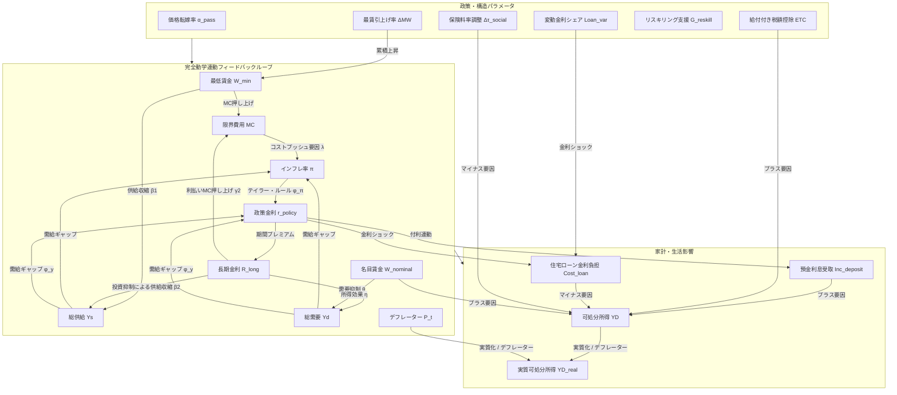

# JAPAN-A_Living 数理設計仕様書 (design_specification.md)

本仕様書は、「JAPAN-A_Living 国民生活・雇用影響シミュレーター」における数理方程式系、各政策パラメータの伝播経路、および主要国民生活指標間の連動関係を網羅的に定義した設計ドキュメントです。

---

## 🌌 1. 全体構造とトランスミッション経路 (SFC)
本モデルは、マクロ経済の5大変数（GDP $Y_t$, 政府債務 $B_t$, 政策金利 $r_t$, 長期金利 $R_t$, インフレ率 $\pi_t$）の推移を入力を前提とし、家計部門および労働市場における以下の因果関係（伝播ループ）を四半期（$dt=0.25$）ごとに順次執行します。

---

## 🧠 2. 家計・労働・マクロ完全動学方程式系

シミュレーションの毎期（$t \to t+1$）において実行される差分方程式の厳密な定義です。本モデルは、マクロシナリオの固定入力を排し、スライダー操作が相互にフィードバックし合う閉ループ動学システムとして動作します。

### 2.1 限界費用と総供給（供給収縮）
最低賃金の上昇と金利水準が、企業の限界費用 $MC_t$ を押し上げ、生産能力（総供給 $Y_{s, t}$）を収縮させる効果を表します。

1. **限界費用 ($MC_t$)**
   $$MC_t = \gamma_1 W_{\text{min}, t} + \gamma_2 R_{\text{long}, t}$$
   - $W_{\text{min}, t}$: 最低賃金指数（$W_{\text{min}, t+1} = W_{\text{min}, t} \times (1 + \Delta MW)$、初期値 1.0）
   - $R_{\text{long}, t}$: 長期金利。
   - $\gamma_1 = 0.005, \gamma_2 = 0.3$

2. **潜在GDP ($Y_{\text{potential}, t}$)**
   $$Y_{\text{potential}, t} = Y_{\text{potential}, 0} \times (1 + g_{\text{pot}})^t$$
   - $Y_{\text{potential}, 0} = 600.0$ 兆円（名目GDP規模基準値）
   - $g_{\text{pot}} = 0.0025$（四半期潜在成長率 0.25% / 年率約 1.0%）

3. **総供給量 ($Y_{s, t}$)**
   $$Y_{s, t} = Y_{\text{potential}, t} \times \max\left(0.5, 1 - W_{min\_impact} - \beta_2 (R_{\text{long}, t-1} - R_{\text{neutral}})\right)$$
   $$W_{min\_impact} = \beta_1 (W_{\text{min}, t} - 1.0) \times (2.0 - 2.0 \alpha_{\text{pass}})$$
   - $\beta_1 = 0.1$（最低賃金による供給弾性値。最賃が10%上がると供給が1%収縮する基本パラメータ）
   - $\alpha_{\text{pass}}$: 中小企業価格転嫁率。完全転嫁（1.0）に近いほどマークアップ（利益率）が保護され、人件費上昇に伴う供給収縮（廃業や投資抑制）が回避されます。逆に転嫁困難（0.0）に近いほど利益率が直撃を受け、供給収縮ペナルティが最大2倍に悪化します（基準値0.5のときに従来モデルと同一の挙動）。
   - $\beta_2 = 0.5$（金利上昇による供給弾性値。金利が2%上がると供給が1%収縮）
   - $R_{\text{neutral}} = 0.015$（中立長期金利 1.5%）
   - $\max(0.5, \dots)$: 供給の崩壊を防ぐ下限ガード

### 2.2 コストプッシュ型インフレ動学
インフレ率 $\pi_t$ は、マクロの需給ギャップと、企業の限界費用の上昇による売り手価格転嫁の２つのメカニズムから動的に決定されます。

1. **需給ギャップ率 ($gap\_ratio_t$)**
   $$gap\_ratio_t = \frac{Y_{\text{demand}, t-1} - Y_{s, t}}{Y_{s, t}}$$

2. **インフレ率 ($\pi_t$)**
   $$\pi_t = \pi_{\text{expected}, t} + \kappa \cdot \text{clamp}(gap\_ratio_t, -0.25, 0.25) + \lambda \max\left(0, \frac{MC_t - MC_{t-1}}{MC_{t-1}}\right) \times (2.0 \alpha_{\text{pass}}) + \phi_{\text{fx}} \cdot \left( \frac{E_t - E_{\text{init}}}{E_{\text{init}}} \right) \times (1 - Self\_Suff)$$
   - $\pi_{\text{expected}, t}$: シナリオ基準で設定される期待（予想）インフレ率（約 1.5%〜2.0% 目標）
   - $\kappa = 0.10$（需給ギャップインフレ感応度。供給不足にともなうディマンド・プル圧力の表現を強めつつ、過度な振幅を抑え0.10へマイルド化）
   - $\lambda = 0.12$（限界費用インフレ感応度。コストプッシュインフレを表現。価格転嫁率 $\alpha_{\text{pass}}$ に比例。過敏な急騰を防ぐため0.12へ平滑化）
   - $\phi_{\text{fx}} = 0.16$（マクロインフレへの為替ショック感応度。輸入物価高によるコストプッシュを表現。四半期ベースで 0.04）
   - $\text{clamp}(gap\_ratio_t, -0.25, 0.25)$: 深刻な供給不足時の物不足によるインフレを表現するため、クランプ上限を15%から25%に緩和。
   - $\pi_{\text{clamped}} = \max(-0.05, \min(0.25, \pi_t))$: デフレ螺旋と超インフレ発散を防ぐための安全ガード（下限-5%、上限25%）

### 2.3 テイラー・ルール（金融政策フィードバック）
インフレ目標値（$\pi_{\text{target}}$）からの乖離と需給ギャップに対応して、中央銀行（日銀）が金利を引き上げる金利ショック動学です。

1. **政策金利 ($r_{\text{policy}, t}$)**
   $$r_{\text{policy}, t} = \max\left(0.0, \min\left(0.15, r_{\text{neutral}} + \phi_{\pi} (\pi_{\text{clamped}} - \pi_{\text{target}}) + \phi_y \cdot gap\_ratio_t\right)\right)$$
   - $r_{\text{neutral}} = 0.01$（中立政策金利 1.0%）
   - $\pi_{\text{target}} = 0.02$（目標インフレ率 2.0%）
   - $\phi_{\pi} = 1.2$（インフレギャップ感応度）
   - $\phi_y = 0.3$（需給ギャップ感応度）
   - $\max(0.0), \min(0.15)$: ゼロ金利制約および利上げ上限（15%）ガード

2. **長期金利 ($R_{\text{long}, t}$)**
   $$R_{\text{long}, t} = r_{\text{policy}, t} + term\_premium$$
   - $term\_premium = 0.008$（期間プレミアム 0.8%）

### 2.4 総需要動学
総需要 $Y_{\text{demand}, t}$ は、金利上昇にともなう投資・消費抑制効果と、名目平均賃金の上昇による購買力押し上げ効果を合わせて決定されます。

1. **総需要量 ($Y_{\text{demand}, t}$)**
   $$Y_{\text{demand}, t} = Y_{\text{potential}, t} \times \max\left(0.6, 1 - \theta (R_{\text{long}, t} - R_{\text{neutral}}) + \eta \frac{W_{\text{nominal}, t} - 100}{100} + \gamma_{etc} \frac{ETC_t}{Y_{\text{potential}, t}}\right)$$
   - $\theta = 0.3$（金利の需要抑制効果。金利1%上昇で総経済需要が0.3%減少する。急激な需要冷え込みによる振幅を抑えるため0.3へ平滑化）
   - $\eta = 0.2$（名目賃金の需要押し上げ効果。名目賃金10%上昇で総需要が2%増加）
   - $\gamma_{etc} = 0.8$（給付付き税額控除の需要乗数効果。給付金の80%がマクロ個人消費として総需要を押し上げます）
   - $\max(0.6, \dots)$: 需要の崩壊を防ぐ下限ガード

### 2.5 賃金・格差決定動学
平均名目賃金 $W_{\text{nominal}, t}$ は、インフレ率への追随、マクロ需給ギャップ、および中小企業の価格転嫁率 $\alpha_{\text{pass}}$ に基づいて決定されます。

1. **平均名目賃金の更新 ($W_{\text{nominal}, t+1}$)**
   $$W_{\text{nominal}, t+1} = W_{\text{nominal}, t} \times (1 + g_{w, t})$$
   $$g_{w, t} = 0.0025 + 0.4 \times \pi_{\text{clamped}} + 0.1 \times gap\_ratio_t + 0.015 \times (\alpha_{\text{pass}} - 0.5) + \text{最賃寄与}_{t+1}$$
   - $0.0025$: 四半期基準名目賃金上昇率 (年率約1.0%相当)
   - $\text{最賃寄与}_{t+1} = 0.05 \times \Delta MW$ (最低賃金上昇による底上げ効果)

2. **大中小企業賃金格差 ($Gap_{\text{wage}, t}$)**
   大企業賃金と中小企業賃金の乖離率です。
   $$Gap_{\text{wage}, t} = Gap_{\text{wage}, 0} \times (1 + \Delta Gap_t)$$
   $$\Delta Gap_t = 0.02 \times (1 - \alpha_{\text{pass}}) - 0.005 \times \Delta MW$$
   - 価格転嫁率 $\alpha_{\text{pass}}$ が低いほど格差が拡大し、最低賃金引き上げ（$\Delta MW$）は中小の底上げとして格差を緩和します。

### 2.6 金利上昇にともなう家計収支の二面性 (Interest Duality)
利上げは預金保有家計に利息収入をもたらす一方、負債保有家計に返済増をもたらします。

1. **預金利息受取フロー ($Inc_{\text{deposit}, t}$)**
   $$Inc_{\text{deposit}, t} = Balance_{\text{deposit}, t} \times \left( r_{\text{policy}, t} \times 0.5 \right) \times 0.25$$
   - $Balance_{\text{deposit}, 0} = 200.0$ 兆円（家計貯蓄ストック）

2. **住宅ローン支払金利負担フロー ($Cost_{\text{loan}, t}$)**
   $$Cost_{\text{loan}, t} = Balance_{\text{loan}, t} \times \left( Loan_{\text{var}} \times r_{\text{policy}, t} + (1 - Loan_{\text{var}}) \times R_{\text{init}} \right) \times 0.25$$
   - $Balance_{\text{loan}, 0} = 80.0$ 兆円（住宅ローン債務ストック）
   - $Loan_{\text{var}}$: 変動金利型ローン比率スライダー
   - $R_{\text{init}}$: 固定金利基準値 (1.50%固定)

### 2.7 可処分所得と実質生活指数（デフレーター基準）
インフレの累積効果を表現するため、物価デフレーター $P_t$ を導入し、実質的な購買力の推移を厳密に評価します。

1. **可処分所得 ($YD_t$)**
   $$YD_t = \left( W_{\text{nominal}, t} \times 3.6 \right) + Inc_{\text{deposit}, t} - Cost_{\text{loan}, t} - \text{Tax}_t - \text{Social\_Premium}_t + \text{ETC}_t$$
   - $3.6$: 基準賃金指数（初期値100）をマクロ総雇用所得規模（約360兆円）に合わせるスケーリング係数
   - $\text{Tax}_t = YD_{\text{gross}, t} \times 0.10$ (簡易実効税率 10.0%)
   - $\text{Social\_Premium}_t = YD_{\text{gross}, t} \times (0.15 + \Delta \tau_{\text{social}})$

2. **価格デフレーター ($P_t$)**
   $$P_t = P_{t-1} \times (1 + \pi_{\text{clamped}})$$
   - $P_0 = 1.0$ （初期値）

3. **実質可処分所得 ($YD_{\text{real}, t}$)**
   $$YD_{\text{real}, t} = \frac{YD_t}{P_t}$$
   - インフレ率が毎期蓄積することで物価デフレーターが上昇し、名目可処分所得 $YD_t$ が実質化されます。

4. **生活実感インフレ率 ($\pi_{\text{living}, t}$)**
   食料安全保障（食料自給率 $Self\_Suff$）および為替レート $E_t$ 変動を加味した、家計が実際に直面する生活費インフレ率です。第0期（初期値）においても同様の為替・自給率補正が適用され、シナリオ切り替え時の不連続ギャップが防止されます。
   $$\pi_{\text{living}, t} = \pi_{\text{clamped}} + 0.24 \times \left( \frac{E_t - E_{\text{init}}}{E_{\text{init}}} \right) \times (1 - Self\_Suff)$$
   - $Self\_Suff$: 食料自給率スライダー (初期値 0.38)

### 2.8 労働市場・就業調整・リスキリング動学
最低賃金上昇に伴う就業調整（年収の壁）、および政府支援による労働移動・失業率の動学です。

1. **年収の壁にともなう労働供給ペナルティ ($L_{\text{penalty}, t}$)**
   最低賃金の上昇率に比例して、扶養内枠を超えないよう非正規労働者が就業時間を削減する（労働供給の縮小）効果。
   $$L_{\text{penalty}, t} = \max\left(0.0, 0.04 \times \left( \frac{\Delta MW}{0.03} \right) \times (1 - 0.20) \times 100\right)$$
   - 最低賃金の上昇幅 $\Delta MW$ が大きくなるほどペナルティが直線的に増大します。

2. **リスキリング・労働移動効果**
   政府支出 $G_{\text{reskill}}$ による中長期的な生産性・潜在成長率の補正。
   - **投資・摩擦期 ($t \le 8$ 四半期=2年間)**: 労働移動の摩擦的調整（一時的生産低下ペナルティ）。
     $$\text{friction}_t = -0.0005 \times G_{\text{reskill}}$$
   - **効果発現期 ($t > 8$ 四半期以降)**: 成長産業への移動成功に伴う生産性・潜在GDP上昇の寄与。
     $$\text{productivity\_boost}_t = 0.001 \times G_{\text{reskill}}$$

3. **失業率 ($Unemployment\_Rate_t$)**
   マクロ経済の需給ギャップ、就業調整、およびリスキリングにともなう摩擦・マッチング効果から決定される失業率です。
   $$Unemployment\_Rate_t = \max\left(1.5, U_{natural} - \theta_{gap} \cdot gap\_ratio_t + \theta_{penalty} \cdot L_{penalty, t} + U_{friction, t}\right)$$
   - $U_{natural} = 2.5\%$: 日本の直近の実績値（2026年4月時点の完全失業率2.5%）を基準初期値とします。
   - $\theta_{gap} = 0.15$: 景気後退期の需給ギャップ悪化にともなう失業増加感応度。
   - $\theta_{penalty} = 0.20$: 最低賃金引き上げにともなう労働抑制・不完全雇用が、一部失業に転化する割合。
   - $U_{friction, t}$: リスキリングにともなう雇用影響。前半2年間（$t \le 8$期）は労働移動の一時的な摩擦的失業（$+0.05 \times G_{\text{reskill}}$）を発生させ、後半（$t > 8$期）はマッチング成功にともない構造的失業を解消（$-0.08 \times G_{\text{reskill}}$）します。
   - $\max(1.5, \dots)$: 完全雇用の限界値としてのボトムライン・ガード。

---

## 🧭 3. 初期状態ハイドレーションおよび基準パラメータ (t=0)
シミュレーション開始時における基準実態データハイドレーション値。

- 平均名目賃金指数 ($W_{\text{nominal}, 0}$): 100.0
- 変動金利住宅ローン残高 ($Balance_{\text{loan}, 0}$): 80.0 兆円
- 家計貯蓄預金残高 ($Balance_{\text{deposit}, 0}$): 200.0 兆円
- 基準社会保険料率 ($\tau_{\text{social}, 0}$): 15.0%
- 基準大中小企業賃金乖離率 ($Gap_{\text{wage}, 0}$): 30.0% (中小企業賃金は大企業の70%水準と設定)

### マクロ動学的初期値・基準パラメータ
- 潜在GDP基準値 ($Y_{\text{potential}, 0}$): 600.0 兆円
- 基準最低賃金指数 ($W_{\text{min}, 0}$): 1.0
- 価格デフレーター初期値 ($P_0$): 1.0
- 中立長期金利 ($R_{\text{neutral}}$): 1.5%
- 中立政策金利 ($r_{\text{neutral}}$): 1.0%
- 目標インフレ率 ($\pi_{\text{target}}$): 2.0%
- 期間プレミアム ($term\_premium$): 0.8%
- 初期の限界費用基準値 ($MC_0$): 0.015
