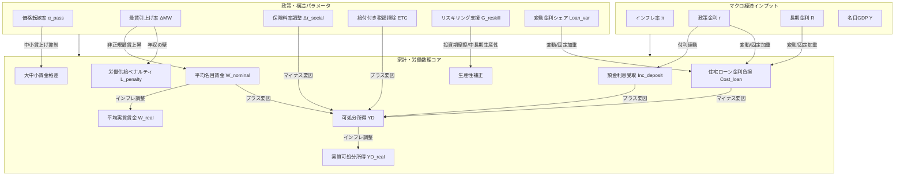

# JAPAN-A_Living 数理設計仕様書 (design_specification.md)

本仕様書は、「JAPAN-A_Living 国民生活・雇用影響シミュレーター」における数理方程式系、各政策パラメータの伝播経路、および主要国民生活指標間の連動関係を網羅的に定義した設計ドキュメントです。

---

## 🌌 1. 全体構造とトランスミッション経路 (SFC)
本モデルは、マクロ経済の5大変数（GDP $Y_t$, 政府債務 $B_t$, 政策金利 $r_t$, 長期金利 $R_t$, インフレ率 $\pi_t$）の推移を入力を前提とし、家計部門および労働市場における以下の因果関係（伝播ループ）を四半期（$dt=0.25$）ごとに順次執行します。

---

## 🧠 2. 家計・労働動学方程式系
シミュレーションの毎期（$t \to t+1$）において実行される差分方程式の厳密な定義です。

### 2.1 賃金・格差決定動学
平均名目賃金 $W_{\text{nominal}, t}$ は、インフレ率への追随、マクロ需給ギャップ、および中小企業の価格転嫁率 $\alpha_{\pass}$ に基づいて決定されます。

1. **平均名目賃金の更新 ($W_{\text{nominal}, t+1}$)**
   $$W_{\text{nominal}, t+1} = W_{\text{nominal}, t} \times (1 + g_{w, t})$$
   $$g_{w, t} = 0.0025 + 0.4 \times \pi_{t+1} + 0.1 \times \text{gdpGapRate}_{t+1} + 0.015 \times (\alpha_{\text{pass}} - 0.5) + \text{最賃寄与}_{t+1}$$
   - $0.0025$: 四半期基準名目賃金上昇率 (年率約1.0%相当)
   - $\text{gdpGapRate}_t$: マクロGDP需給ギャップ率
   - $\text{最賃寄与}_{t+1} = 0.05 \times \Delta MW$ (最低賃金上昇による底上げ効果)

2. **平均実質賃金 ($W_{\text{real}, t}$)**
   $$W_{\text{real}, t} = \frac{W_{\text{nominal}, t}}{1 + \pi_t}$$

3. **大中小企業賃金格差 ($Gap_{\text{wage}, t}$)**
   大企業賃金 ($W_{\text{big}}$) と中小企業賃金 ($W_{\text{small}}$) の乖離率です。
   $$Gap_{\text{wage}, t} = Gap_{\text{wage}, 0} \times (1 + \Delta Gap_t)$$
   $$\Delta Gap_t = 0.02 \times (1 - \alpha_{\text{pass}}) - 0.005 \times \Delta MW$$
   - 価格転嫁率 $\alpha_{\text{pass}}$ が低いほど、中小企業側の利幅が圧迫され大企業との賃金差が拡大（+2%）します。最低賃金の上昇は中小の底上げとなり、格差をやや縮小（-0.5%）させます。

### 2.2 金利上昇にともなう家計収支の二面性 (Interest Duality)
利上げは預金保有家計に利息収入をもたらす一方、負債保有家計に返済増をもたらします。

1. **預金利息受取フロー ($Inc_{\text{deposit}, t}$)**
   $$Inc_{\text{deposit}, t} = Balance_{\text{deposit}, t} \times \left( r_t \times 0.5 \right) \times 0.25$$
   - $Balance_{\text{deposit}, 0} = 200.0$ 兆円（家計貯蓄ストック）
   - 預金金利は、政策金利 $r_t$ の50%の感応度で上昇すると近似。

2. **住宅ローン支払金利負担フロー ($Cost_{\text{loan}, t}$)**
   $$Cost_{\text{loan}, t} = Balance_{\text{loan}, t} \times \left( Loan_{\text{var}} \times r_t + (1 - Loan_{\text{var}}) \times R_{\text{init}} \right) \times 0.25$$
   - $Balance_{\text{loan}, 0} = 80.0$ 兆円（住宅ローン債務ストック）
   - $Loan_{\text{var}}$: 変動金利型ローン比率スライダー（初期値 0.70）
   - $R_{\text{init}}$: 固定金利基準値 (1.50%固定)

### 2.3 可処分所得と実質生活指数
家計の可処分所得は、名目賃金（マクロGDP連動スケーリング適用）、金利収支、税および社会保険料、さらに給付付き税額控除などの政策補助を合わせて算出されます。

1. **可処分所得 ($YD_t$)**
   $$YD_t = \left( W_{\text{nominal}, t} \times 3.6 \right) + Inc_{\text{deposit}, t} - Cost_{\text{loan}, t} - \text{Tax}_t - \text{Social\_Premium}_t + \text{ETC}_t$$
   - $3.6$: 基準賃金指数（初期値100）をマクロ総雇用所得規模（約360兆円）に合わせるスケーリング係数
   - $\text{Tax}_t = YD_{\text{gross}, t} \times \tau$ (マクロ所得税率 $\tau$ は Core モデルの入力と同期)
   - $\text{Social\_Premium}_t = YD_{\text{gross}, t} \times (\tau_{\text{social}, 0} + \Delta \tau_{\text{social}})$
     - $\tau_{\text{social}, 0} = 0.15$ (社会保険料率の初期基準値 15.0%)
     - $\Delta \tau_{\text{social}}$: 社会保険料率調整スライダー
   - $\text{ETC}_t$: 給付付き税額控除スライダー

2. **生活実感インフレ率 ($\pi_{\text{living}, t}$)**
   食料安全保障（食料自給率 $Self\_Suff$）および為替レート $E_t$ 変動を加味した、家計が実際に直面する生活費インフレ率です。
   $$\pi_{\text{living}, t} = \pi_t + 0.12 \times \max\left(0, \frac{E_t - E_{\text{init}}}{E_{\text{init}}}\right) \times (1 - Self\_Suff)$$
   - $Self\_Suff$: 食料自給率スライダー (初期値 0.38)
   - 自給率が低いほど、円安に伴う食料品・生活必需品インフレ率の押し上げ幅が増大します。

3. **実質可処分所得 ($YD_{\text{real}, t}$)**
   $$YD_{\text{real}, t} = \frac{YD_t}{1 + \pi_{\text{living}, t}}$$

### 2.4 労働市場・就業調整・リスキリング動学
最低賃金上昇に伴う就業調整（年収の壁）および、政府支援による労働移動の動学です。

1. **年収の壁にともなう労働供給ペナルティ ($L_{\text{penalty}, t}$)**
   最低賃金の上昇率に比例して、扶養内枠を超えないよう非正規労働者が就業時間を削減する（労働供給の縮小）効果。
   $$L_{\text{penalty}, t} = 0.04 \times \left( \frac{MW_t - MW_{\text{init}}}{MW_{\text{init}}} \right) \times (1 - \beta_{\text{wall}})$$
   - $\beta_{\text{wall}}$ [0.0 - 1.0]: 年収の壁緩和・見直し施策度スライダー（初期値 0.20）
   - 最低賃金 $MW_t$ の上昇に対して、壁見直し策（$\beta_{\text{wall}}$）が打たれない場合、労働供給が最大で約4%減少する就業調整が発生します。

2. **リスキリング・労働移動効果 ($g_{\text{prod}, t}$)**
   政府支出 $G_{\text{reskill}}$ による中長期的な生産性・潜在成長率の補正。
   - **投資・摩擦期 ($t \le 8$ 四半期=2年間)**: 労働移動の摩擦的調整（一時的生産低下ペナルティ）。
     $$\text{friction}_t = -0.0015 \times G_{\text{reskill}}$$
   - **効果発現期 ($t > 8$ 四半期以降)**: 成長産業への移動成功に伴う生産性・潜在GDP上昇の寄与。
     $$\text{productivity\_boost}_t = 0.0025 \times G_{\text{reskill}}$$
   - リスキル支援は、短期的にはミスマッチや一時的生産減を招きますが、中長期的には潜在成長率を最大1.25%（5兆円満額投資時）押し上げ、マクロ名目賃金の成長を後押しします。

---

## 🧭 3. 初期状態ハイドレーションパラメータ (t=0)
シミュレーション開始時における基準実態データハイドレーション値。

- 平均名目賃金指数 ($W_{\text{nominal}, 0}$): 100.0
- 変動金利住宅ローン残高 ($Balance_{\text{loan}, 0}$): 80.0 兆円
- 家計貯蓄預金残高 ($Balance_{\text{deposit}, 0}$): 200.0 兆円
- 基準社会保険料率 ($\tau_{\text{social}, 0}$): 15.0%
- 基準大中小企業賃金乖離率 ($Gap_{\text{wage}, 0}$): 30.0% (中小企業賃金は大企業の70%水準と設定)
